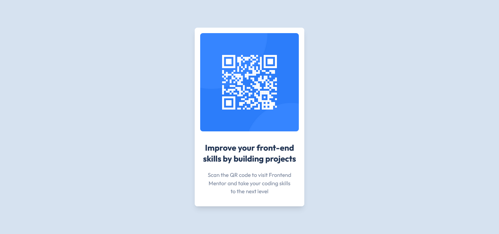

# Frontend Mentor - QR Code Component solution

This is a solution to the [QR code component challenge on Frontend Mentor](https://www.frontendmentor.io/challenges/qr-code-component-iux_sIO_H). Frontend Mentor challenges help you improve your coding skills by building realistic projects.

## Table of contents

- [Frontend Mentor - QR Code Component solution](#frontend-mentor---qr-code-component-solution)
  - [Table of contents](#table-of-contents)
  - [Overview](#overview)
    - [Screenshot](#screenshot)
    - [Links](#links)
  - [My process](#my-process)
    - [Built with](#built-with)
  - [Author](#author)

## Overview

### Screenshot

### Links

- Solution URL: [Right here!](https://www.frontendmentor.io/solutions/qr-code-component-built-with-svelte-windicss-and-vite-as-build-tool-SJE_Mk8Qq)
- Live Site URL: [Deployed on Vercel](https://qr-code-component-navy.vercel.app/)

## My process

### Built with

- [Svelte](https://svelte.dev/)
- [WindiCSS](https://windicss.org/) + Svelte Transition API
- Flexbox
- Mobile-first workflow
- Vite

## Author

- Frontend Mentor - [@Shawn Lee](https://www.frontendmentor.io/profile/OGShawnLee)
